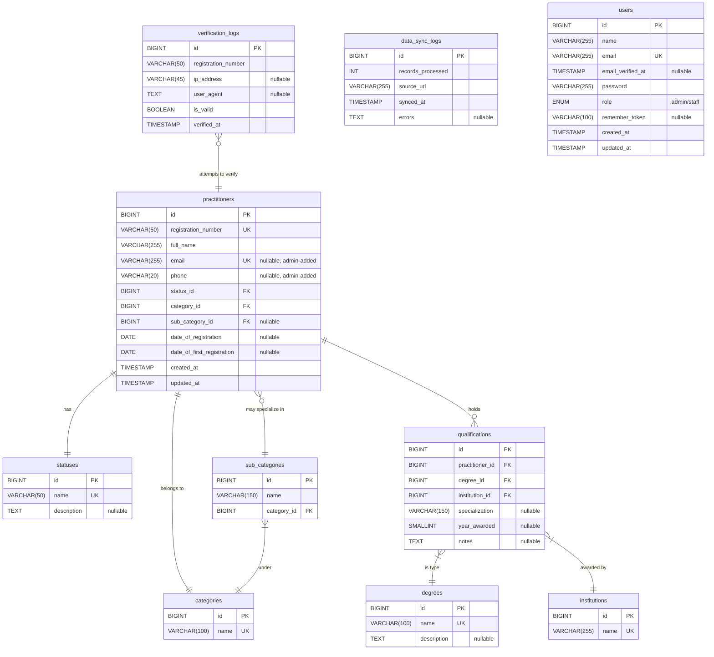

# 🩺 Thibitisha - Doctor Verification

## 🗃️ Database Design

> **Purpose**: Verify if a doctor is legally registered with the **Kenya Medical Practitioners and Dentists Council (KMPDC)**.  
> **Admin Feature**: Admins can register/update practitioner **email** and **phone** for communication (e.g., license alerts).  
> **Data Source**: Core practitioner data synced from [KMPDC Register](https://kmpdc.go.ke/Registers/practitioners.php).

---

## 🔷 Relational Schema Diagram

---

## 📚 Table Descriptions (For Learning)

### 1. `practitioners`
- **Core entity** for every KMPDC-registered doctor/dentist.
- **Foreign keys**:
  - `status_id` → `statuses.id` ✅
  - `category_id` → `categories.id`
  - `sub_category_id` → `sub_categories.id`

### 2. `statuses`
- Lookup table for registration status: `"Active"`, `"Suspended"`, `"Deceased"`, etc.

### 3. `categories` & `sub_categories`
- `categories`: Broad roles (`"Medical Officer"`, `"Dentist"`).
- `sub_categories`: Specializations (`"Paediatrics"`, `"Oral Surgery"`), linked to a `category`.

### 4. `degrees`, `institutions`, `qualifications`
- Normalized rich qualification data into structured, searchable records.
- Example: `"MMed (Surgery – UoN, 2015)"` → broken into degree, institution, specialization, year.

### 5. `verification_logs`
- Logs all verification attempts (valid or invalid).
- `registration_number` is **not a foreign key** (to allow logging of fake/typo attempts).

### 6. `data_sync_logs`
- Tracks KMPDC data ingestion (scraping or manual import).

### 7. `users`
- Admin/staff accounts with `role` (`admin`/`staff`).

---