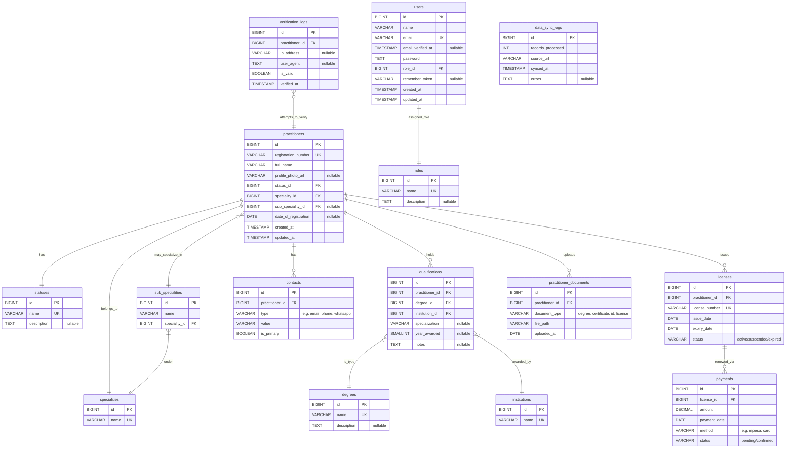

# 📦 Dependency Managers & Composer with Migrations

## 1. What is a Dependency Manager?

A **dependency manager** is a tool that helps developers handle third-party libraries and packages that their project depends on. Instead of manually downloading, storing, and updating libraries, dependency managers automate the process.

### 1.1 Key Roles
1. **Install libraries** quickly with one command.  
2. **Handle versions** so the correct library versions are used.  
3. **Resolve conflicts** when multiple packages require different dependencies.  
4. **Autoload classes** so you don’t manually `require` dozens of files.  

### 1.2 Life Before Dependency Managers (😢)
- Developers had to **download ZIP files** manually.  
- Include them in a `/libs` or `/vendor` folder.  
- Manually track updates, which often led to version mismatches.  
- Copy-paste errors were common, leading to unstable projects.  

---

## 2. Composer: PHP’s Dependency Manager

[Composer](https://getcomposer.org/) is the **standard dependency manager for PHP projects**. It allows you to declare libraries your project needs and installs them in the `vendor/` directory.

### 2.1 Install Composer on Ubuntu 24.04 via `apt`

#### Step 1: Update system packages
```bash
sudo apt update
````

#### Step 2: Install Composer

```bash
sudo apt install -y composer
```

#### Step 3: Verify installation

```bash
composer --version
```

You should see something like:

```
Composer version 2.x.x 2025-xx-xx xx:xx:xx
```

---

## 3. Composer Basics

### 3.1 Initializing a Project

```bash
composer init
```

This creates a `composer.json` file where dependencies are listed.

### 3.2 Installing a Package

Example: Install the HTTP client `guzzlehttp/guzzle`.

```bash
composer require guzzlehttp/guzzle
```

This:

* Downloads it to `vendor/`
* Adds it to `composer.json`
* Updates `composer.lock`

### 3.3 Versioning in Composer

* `^1.2` → install 1.2 or higher (but below 2.0)
* `~1.2` → install latest up to 1.3 (but below 1.4)
* `1.2.*` → install latest 1.2.x version
* `dev-main` → use development branch

This ensures **reproducibility** across environments.

### 3.4 Autoloading

One of Composer’s best features is **autoloading**.
Instead of writing:

```php
require 'src/User.php';
require 'src/Auth.php';
```

You can just do:

```php
require 'vendor/autoload.php';
```

Composer loads all classes automatically, following [PSR-4 autoloading standard](https://www.php-fig.org/psr/psr-4/).

---

## 4. Database Migrations with Composer (Phinx)

In modern PHP projects, we manage database schemas with **migrations** (structured scripts for creating/modifying tables).

We’ll use [Phinx](https://phinx.org/), a database migration tool.

### 4.1 Install Phinx

```bash
composer require robmorgan/phinx
```

### 4.2 Initialize Phinx

```bash
vendor/bin/phinx init
```

This creates a `phinx.php` config file where you define your database connection.

Example `phinx.php`:

```php
<?php

return [
    'paths' => [
        'migrations' => '%%PHINX_CONFIG_DIR%%/db/migrations',
        'seeds' => '%%PHINX_CONFIG_DIR%%/db/seeds'
    ],
    'environments' => [
        'default_database' => 'development',
        'development' => [
            'adapter' => 'mysql',
            'host' => '127.0.0.1',
            'name' => 'doctor_verification',
            'user' => 'root',
            'pass' => '',
            'port' => 3306,
            'charset' => 'utf8',
        ],
    ],
];
```

---

## 5. Example: Users Table Migration

Create a migration:

```bash
vendor/bin/phinx create CreateUsersTable
```

Edit the generated file in `db/migrations/`:

```php
<?php
declare(strict_types=1);

use Phinx\Migration\AbstractMigration;

final class CreateUsersTable extends AbstractMigration
{
    public function change(): void
    {
        $table = $this->table('users');
        $table->addColumn('name', 'string')
              ->addColumn('email', 'string', ['limit' => 255])
              ->addColumn('email_verified_at', 'timestamp', ['null' => true])
              ->addColumn('password', 'string')
              ->addColumn('role_id', 'biginteger')
              ->addColumn('remember_token', 'string', ['null' => true])
              ->addTimestamps()
              ->addIndex(['email'], ['unique' => true])
              ->create();
    }
}
```

Run the migration:

```bash
vendor/bin/phinx migrate
```

This creates the **users** table in your DB.

---

## 6. Mini Assignment

Using Phinx, define migrations for the following schema.
Focus on **table structure, relationships, and indexes**.

### 🩺 Thibitisha Schema Diagram



👉 **Task:** Write Phinx migrations for all tables in this schema.
Hint: Use the `users` table migration as a guide.
