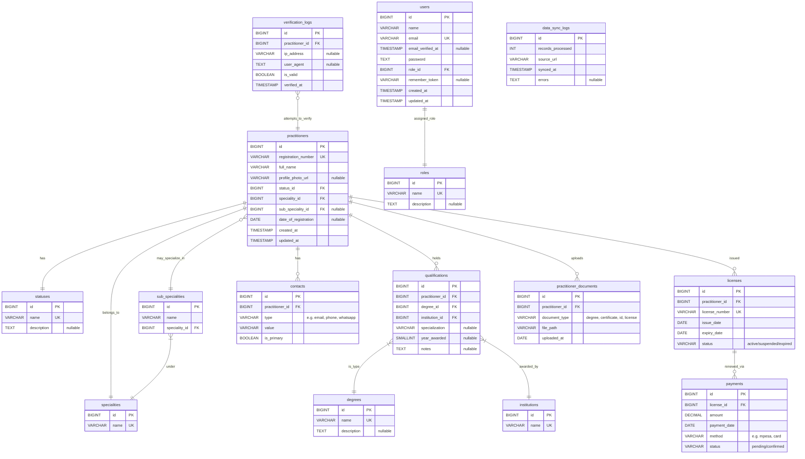

# Doctor Verification Database Schema – Suggestions
---

## 1. Practitioner Enhancements

* Added `profile_photo_url` for doctor profile images.
* Removed redundant `date_of_first_registration`.
* Linked practitioners to **contacts**, **licenses**, and **practitioner_documents** tables.

---

## 2. Contact Information Normalization

* New **`contacts` table** to store multiple practitioner contact points (phone, email, WhatsApp, etc.) with support for `is_primary`.

---

## 3. Specialities & Sub-Specialities

* **Renamed tables**:

  * `categories` → `specialities`
  * `sub_categories` → `sub_specialities`
* Updated all foreign keys accordingly.

---

## 4. License Management

* New **`licenses` table** for license number, issue date, expiry date, and status.
* New **`payments` table** for tracking license renewal payments.

---

## 5. Practitioner Documents

* New **`practitioner_documents` table** for degree certificates, licenses, IDs, and other supporting documents.

---

## 6. User & Role Management

* Introduced a dedicated **`roles` table** instead of ENUM for flexible role assignment.
* `users.role_id` now references `roles.id`.

---

## 7. Security & Logging

* Improved **verification_logs**: added `practitioner_id` FK for better referential integrity.
* Retained `data_sync_logs` for system-level synchronization traceability.

---

## 8. General Improvements

* Enforced **consistent singular naming**.
* Reduced redundancy and improved normalization.
* Added extensibility for future fields (e.g., audit, compliance).

---

## 🙏 Thank You for your feedback :)

Your suggestions were crucial in identifying gaps and prioritizing improvements.
Here is a breakdown of the **recurring themes** you raised, grouped by category:

| Theme                        | Frequency |
| ---------------------------- | --------- |
| Contacts normalization       | 23        |
| Normalization/schema cleanup | 20        |
| Workplace/location           | 17        |
| Audit trail/logs             | 17        |
| License tracking             | 13        |
| Years of experience          | 10        |
| Personal details             | 10        |
| Security (hashing/passwords) | 8         |
| Role/permissions             | 7         |
| Doctor rating/reviews        | 4         |

## Updated Schema

> "In God we Trust, all others bring data!" - W. Edwards Deming